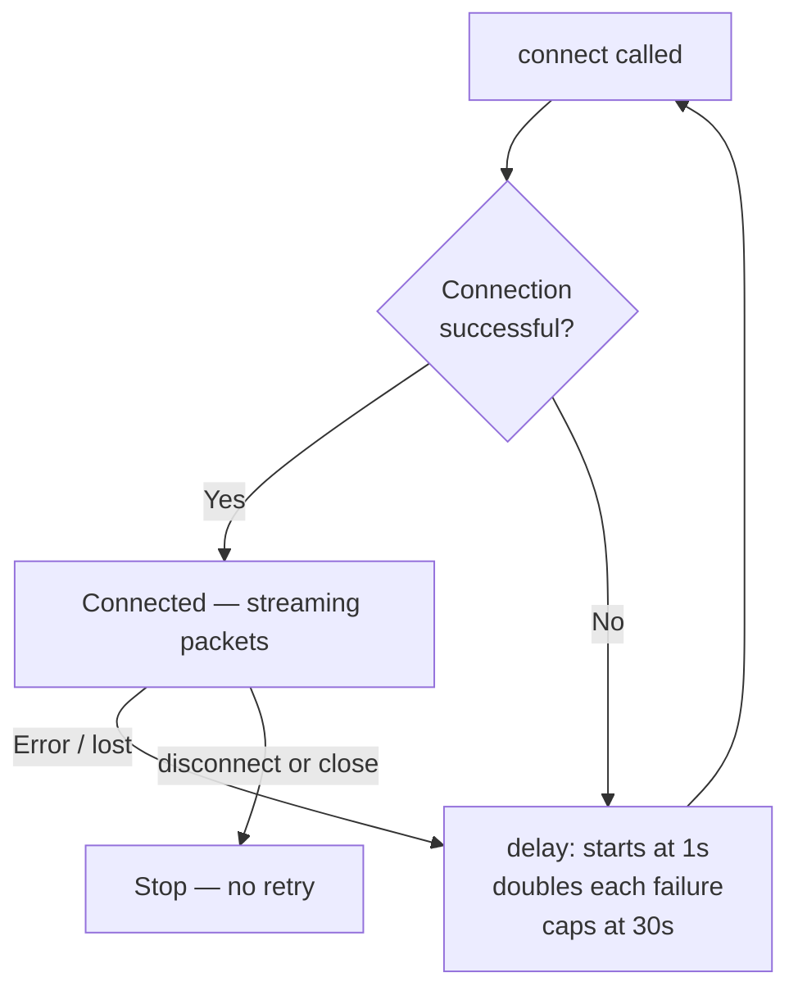

# Connectivity

## Device Discovery

Lightnet controllers advertise themselves via mDNS as `lightnet-<chipid>.local` with service type `_lightnet._tcp`.

=== "Android"
    `NsdServiceDiscovery` uses the Android `NsdManager` API to browse for `_lightnet._tcp` services. Discovered devices are surfaced automatically in the device list.

=== "iOS"
    `StubServiceDiscovery` is a stub — mDNS browsing for iOS is not yet implemented. Devices must be added manually by IP address or hostname.

`DeviceRepository` persists known devices using `multiplatform-settings` so they survive app restarts.

---

## Binary WebSocket Protocol

The app communicates with the controller over a **binary WebSocket** at `ws://<host>:<port>/ws`.

### Packet format

Every packet has a fixed 14-byte header followed by a variable-length payload:

```
[type:u8][version:u16LE][nonce:u32LE][headerCRC:u16LE][payloadCRC:u16LE][payloadSize:u16LE][payload…]
```

- All multi-byte integers are **little-endian** — enforced by `ByteReader`/`ByteWriter`
- CRC-16 is computed separately over the 7-byte header and over the payload
- `MessageParser.parse(ByteArray)` validates both CRCs and returns `Result.Success/Failure`

!!! note "CRC variant"
    The firmware uses CRC-16/IBM (poly `0x8005`, no reflection). The mobile app uses the reflected equivalent (poly `0xA001`). Both produce the same result — the reflected poly is the standard software implementation of the same algorithm.

### Outgoing commands

| Type | Value | Payload |
|---|---|---|
| `GET_EDGES_LIST` | 4 | empty |
| `GET_PANELS_STATES` | 5 | empty |
| `TOGGLE` | 1 | `address:u8, state:u8` |
| `SET_BRIGHTNESS` | 2 | `address:u8, brightness:u8` |
| `SET_COLOR` | 3 | `address:u8, r:u8, g:u8, b:u8` |
| `ANIMATION_TRIGGER` | 8 | `groupId:u8, value:u8` |

Outgoing messages extend `Message` and implement `encodePayload(ByteWriter)`.

### Inbound responses

| Type | Value | Decoded by |
|---|---|---|
| `PANELS_STATES` | 6 | `decodePanelsStates(ByteArray)` |
| `EDGES_LIST` | 7 | `decodeEdgesList(ByteArray)` |

Inbound variable-length payloads are decoded by top-level functions in `api/websocket/protocol/`.

---

## Reconnection

`SocketConnector` uses exponential back-off to reconnect on failure:



A `CancellationException` (from `disconnect()` or `close()`) breaks the loop immediately without a reconnect attempt.

---

## MockConnector

`MockConnector` is a self-contained fake controller that responds to all commands with properly encoded, CRC-correct packets. It is used by the **Demo Device** entry in `DeviceDiscoveryScreen` and is the recommended harness for testing domain logic without physical hardware.

---

## Server-side API

For the full server-side API specification — HTTP endpoints, scene management, animation types, and palette control — see the [Firmware API Reference](../lightnet-firmware/api.md).
