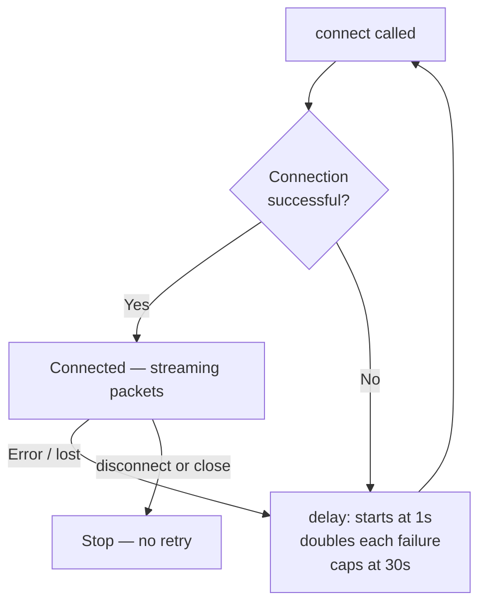

# Connectivity

## Device Discovery

Lightnet controllers advertise themselves via mDNS as `lightnet-<chipid>.local` with service type `_lightnet._tcp`.

=== "Android"
    `NsdServiceDiscovery` uses the Android `NsdManager` API to browse for `_lightnet._tcp` services. Discovered devices are surfaced automatically in the device list.

=== "iOS"
    `StubServiceDiscovery` is a stub — mDNS browsing for iOS is not yet implemented. Devices must be added manually by IP address or hostname.

`DeviceRepository` persists known devices using `multiplatform-settings` so they survive app restarts.

---

## Binary WebSocket Protocol

The app communicates with the controller over a **binary WebSocket** at `ws://<host>:<port>/ws`.

### Packet format

Every packet has a fixed 14-byte header followed by a variable-length payload:

```
[type:u8][version:u16LE][nonce:u32LE][headerCRC:u16LE][payloadCRC:u16LE][payloadSize:u16LE][payload…]
```

- All multi-byte integers are **little-endian** — enforced by `ByteReader`/`ByteWriter`
- CRC-16/IBM (reflected, poly `0xA001`, init `0xFFFF`) is computed separately over the 7-byte header and over the payload
- `MessageParser.parse(ByteArray)` validates both CRCs and returns `Result.Success/Failure`

### Outgoing commands

| Type | Value | Payload |
|---|---|---|
| `TOGGLE` | 1 | `address:u8, state:u8` |
| `SET_COLOR` | 3 | `address:u8, r:u8, g:u8, b:u8` |
| `GET_EDGES_LIST` | 4 | empty |
| `GET_PANELS_STATES` | 5 | empty |
| `ANIMATION_TRIGGER` | 8 | `groupId:u8, value:u8` |
| `SET_MIRROR` | 10 | `enabled:u8` — opt in/out of live I²C packet mirroring |
| `PING` | 11 | empty |

Outgoing messages extend `Message` and implement `encodePayload(ByteWriter)`.

### Inbound responses

| Type | Value | Decoded by |
|---|---|---|
| `PANELS_STATES` | 6 | `decodePanelsStates(ByteArray)` |
| `EDGES_LIST` | 7 | `decodeEdgesList(ByteArray)` |
| `MIRROR_BATCH` | 9 | `decodeMirrorBatch(ByteArray)` — live preview stream |
| `PONG` | 12 | empty — reply to `PING` |

Inbound variable-length payloads are decoded by top-level functions in `api/websocket/protocol/`.

### Live preview (`MIRROR_BATCH`)

Mirroring is **off by default**. When the app enables it (`SET_MIRROR(1)`), the controller unicasts a state snapshot, then streams outbound I²C packets at up to ~30 fps. `PanelMirrorService` feeds these into `PanelPacketRenderer` so the visualiser shows live colours without polling.

---

## Reconnection

`SocketConnector` uses exponential back-off to reconnect on failure:



A `CancellationException` (from `disconnect()` or `close()`) breaks the loop immediately without a reconnect attempt.

---

## DemoConnector

`DemoConnector` (`demo/`) is a self-contained fake controller that responds to all commands with properly encoded, CRC-correct packets. Enable it in **Settings → Enable demo device**; the virtual device then appears at the top of the device list. It is the recommended harness for testing domain logic without physical hardware.

---

## Server-side API

For the full server-side API specification — HTTP endpoints, scene management, animation types, and palette control — see the [Firmware API Reference](../lightnet-firmware/api.md).
