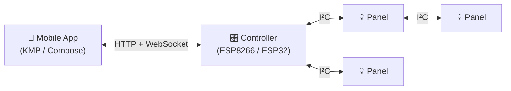

# App Overview

The Lightnet mobile app visualises and controls an addressable LED panel network. It's a Kotlin Multiplatform (KMP) project: one Compose UI, one transport stack, two platform targets (Android and iOS).

## How it fits

The app is a **client** of the controller's APIs. All control flows through the controller — the app never talks to panels directly.

## Architecture

Single Gradle module (`composeApp`) with three source sets:

| Source set | Contents |
|---|---|
| `commonMain` | All logic and UI — runs on Android and iOS |
| `androidMain` | Thin Android wiring: `MainActivity`, `NsdServiceDiscovery` |
| `iosMain` | Stub iOS implementations: `StubServiceDiscovery`, `MainViewController` |

Compose Multiplatform powers the UI throughout `commonMain` — screens and components are written once and shared.

## Supported platforms

=== "Android"
    - Minimum: **API 24 (Android 7.0)**
    - mDNS discovery via Android's `NsdManager`
    - Built with Gradle + AGP

=== "iOS"
    - Minimum: **iOS 13.0**
    - mDNS browsing not yet implemented — devices added manually by IP / hostname
    - Built via Xcode; the KMP shared module is compiled automatically by the Xcode build phase

## Dependency stack

| Component | Version |
|---|---|
| Kotlin | 2.3.21 |
| Compose Multiplatform | 1.10.3 |
| Ktor | 3.1.3 |
| kotlinx-coroutines | 1.10.1 |
| multiplatform-settings | 1.2.0 |
| AGP | 8.11.2 |

---

- [Getting Started](getting-started.md) — build and run on Android or iOS
- [Development](development.md) — code structure and conventions
- [Connectivity](connectivity.md) — binary protocol and device discovery
