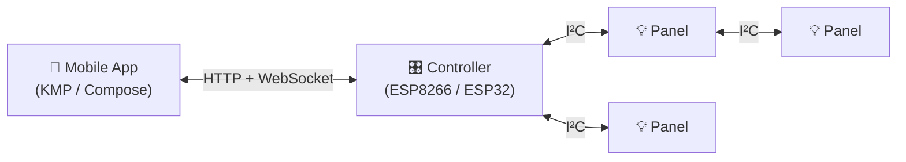

# Lightnet Mobile App

The Lightnet mobile app is a Kotlin Multiplatform (KMP) application for visualising and managing addressable LED panels in a Lightnet network. It communicates with a Lightnet controller device using a custom binary WebSocket protocol to monitor panel states, control LEDs, and trigger animations in real time.

## How It Fits

The mobile app is a **client** of the Lightnet firmware APIs. All control flows through the controller — the app never communicates with panels directly.

## Architecture

The app uses a **single Gradle module** (`composeApp`) with three source sets:

| Source set | Contents |
|---|---|
| `commonMain` | All logic and UI — runs on Android and iOS |
| `androidMain` | Thin Android wiring: `MainActivity`, `NsdServiceDiscovery` |
| `iosMain` | Stub iOS implementations: `StubServiceDiscovery`, `MainViewController` |

Compose Multiplatform is used for the UI throughout `commonMain`, meaning screens and components are written once and shared across platforms.

## Supported Platforms

=== "Android"
    - Minimum: **API 24 (Android 7.0)**
    - Device discovery via `NsdManager` (mDNS)
    - Build tool: Gradle + AGP

=== "iOS"
    - Minimum: **iOS 13.0**
    - mDNS browsing not yet implemented — devices must be added manually by IP/hostname
    - Build tool: Xcode (KMP shared module compiled automatically)

## Key Dependencies

| Component | Version |
|---|---|
| Kotlin | 2.3.21 |
| Compose Multiplatform | 1.10.3 |
| Ktor | 3.1.3 |
| kotlinx-coroutines | 1.10.1 |
| multiplatform-settings | 1.2.0 |
| AGP | 8.11.2 |

---

- [Getting Started](getting-started.md) — Build and run the app
- [Development](development.md) — Code structure and conventions
- [Connectivity](connectivity.md) — Binary protocol and device discovery
