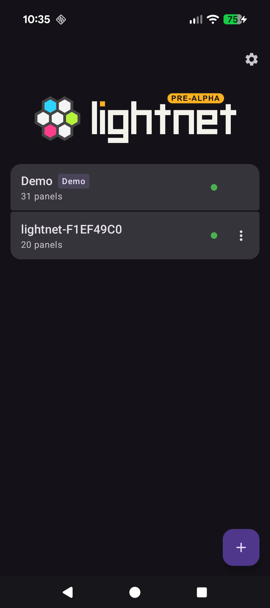
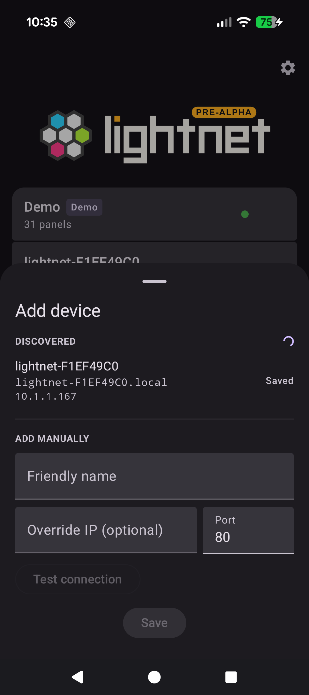
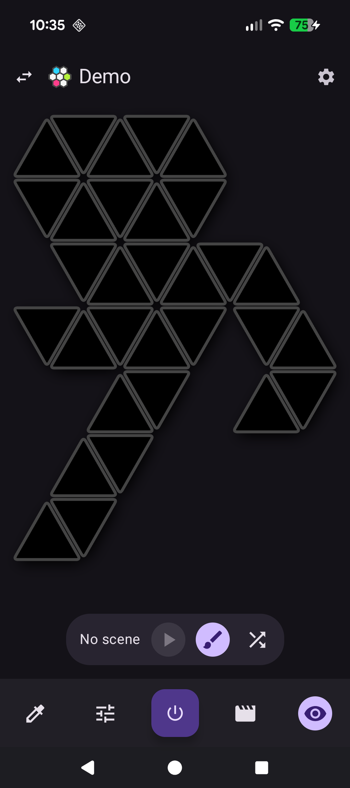
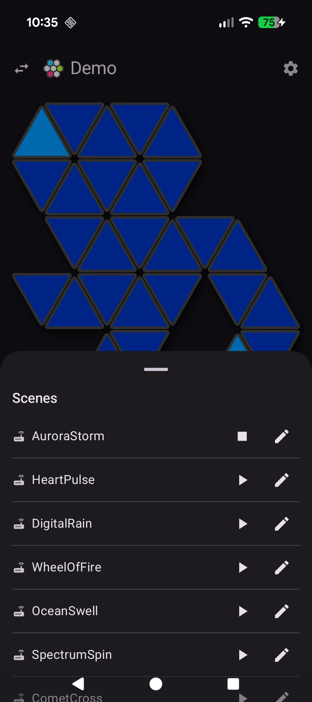
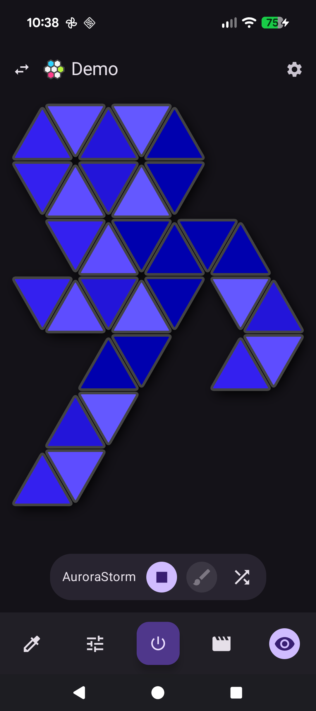
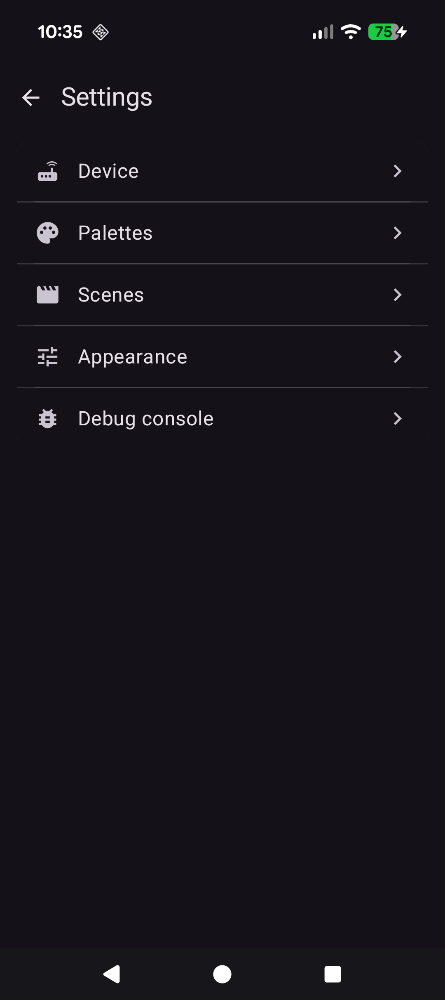
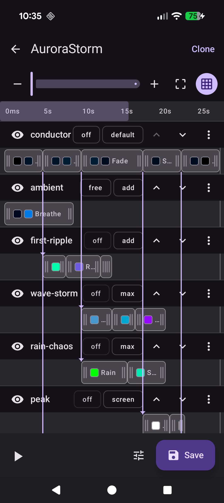

# Screenshots

A quick visual tour of the app.

## Devices

{ width="300" }

The default view — a list of saved devices, each showing connection status and panel count.

## Add device

{ width="300" }

Devices on the local network are discovered automatically via mDNS, or can be added manually by hostname/IP.

## Device controller

{ width="300" }

The main visualiser — tap, drag, or select panels to paint colors, and play scenes.

## Scene playing

{ width="300" }

A scene running live from the scenes sheet, with the panel colors animated in real time.

## Scene active

{ width="300" }

The same scene with the sheet dismissed — full-screen visualiser and toolbar controls.

## Device settings

{ width="300" }

Per-device settings: device info, palettes, scenes, appearance, and a debug console.

## Scene editor

{ width="300" }

Build scenes from layered animations — wave, ripple, sparkle — with adjustable blend modes and timing.
